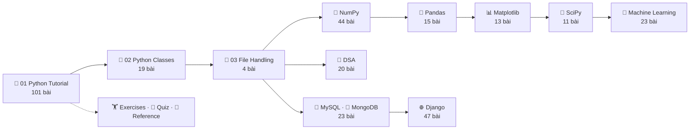

# 🐍 Learn Python — Khóa học Python tiếng Việt bám sát W3Schools


Khóa học Python **từ con số 0 đến ứng dụng thực tế**, viết bằng **tiếng Việt**, dưới dạng **Jupyter Notebook** — mỗi bài là một notebook, mỗi ví dụ là một cell bạn có thể **sửa và chạy ngay**.

Cấu trúc khóa học **bám sát 1:1** theo sidebar của [W3Schools Python Tutorial](https://www.w3schools.com/python/): cùng thứ tự bài, cùng tên mục — nên bạn có thể **học song song** với W3Schools. Mỗi notebook đều có link tới đúng trang W3Schools tương ứng.

---

## ✨ Điểm đặc biệt

| | Tính năng | Ý nghĩa |
|---|---|---|
| 📖 | **Học song song W3Schools** | Mỗi bài có link tới trang W3Schools tương ứng; heading giữ nguyên tiếng Anh + dịch tiếng Việt |
| 🎯 | **Trong bài này** | Mục lục mini ở đầu mỗi bài — biết trước mình sẽ học gì |
| 🧪 | **Try it Yourself** | Cell để tự sửa và chạy lại — thay cho nút *Try it Yourself »* của W3Schools |
| ➕ | **Mở rộng** | Kiến thức bổ sung ngoài W3Schools, được đánh dấu rõ ràng |
| 🧠 | **Ghi nhớ nhanh** | 3–5 ý cốt lõi cuối mỗi bài, kèm ⚠️ lỗi hay gặp |
| 📝 | **Exercise** | Câu hỏi nhanh cuối bài, đáp án ẩn — bấm để xem |
| 🖼️ | **Output thật** | Mọi notebook đã được chạy: xem kết quả, bảng, **biểu đồ** ngay trên GitHub |
| 🏋️ | **Code Challenge tự chấm** | 21 bộ bài tập, có cell kiểm tra ✅ và lời giải ẩn |
| 🏆 | **Quiz chấm điểm** | 3 bài quiz (95 câu) với phiếu trả lời tự chấm |
| 🔁 | **Ôn tập ngắt quãng** | Notebook ôn tập theo hệ thống Leitner + bộ thẻ **Anki** từ ngân hàng câu hỏi |
| ⭐ | **Cheat Sheet** | Toàn bộ cú pháp Python cốt lõi trên [một trang](10_reference/cheatsheet.md) |
| ✅ | **Theo dõi tiến độ** | [PROGRESS.md](PROGRESS.md) — checklist mọi bài học |
| 🗄️ | **Thực hành không cần server** | MySQL → luyện bằng SQLite · MongoDB → luyện bằng mongomock · Django → xem trang web ngay trong notebook |

---

## 🚀 Bắt đầu nhanh

**1. Tải repo về máy**

```bash
git clone https://github.com/ThanhDatVN/python-journey.git
cd python-journey
```

**2. Tạo môi trường ảo và cài thư viện**

```bash
python -m venv .venv
.venv\Scripts\activate          # Windows
source .venv/bin/activate       # macOS / Linux
pip install -r requirements.txt
```

**3. Mở JupyterLab**

```bash
jupyter lab
```

Mở [`01_python_tutorial/001_python_home.ipynb`](01_python_tutorial/001_python_home.ipynb) và bắt đầu! 🎉

> 💡 Dùng **VS Code**? Cài extension *Python* + *Jupyter*, mở thư mục repo, chọn kernel `.venv` là học được ngay.

---

## 📖 Cấu trúc một bài học

```text
┌──────────────────────────────────────────────────────────────┐
│ 🐍 Python Tutorial › Python Variables · Bài 9/124            │ ← breadcrumb + vị trí
│ « Python Comments  •  📚 Mục lục  •  Variable Names »        │ ← điều hướng như W3Schools
├──────────────────────────────────────────────────────────────┤
│ # Python Variables                                           │
│ > 📖 Học song song trên W3Schools: python_variables.asp      │ ← link trang gốc
│ > 🎯 Trong bài này: Creating Variables · Casting · ...       │ ← mục lục mini
├──────────────────────────────────────────────────────────────┤
│ ## Creating Variables — Tạo biến                              │ ← heading như W3Schools
│ Giải thích tiếng Việt...                                     │
│ [ cell ví dụ ]  →  output                                    │
│ > 🧪 Try it Yourself — sửa code rồi Shift + Enter            │
│ [ cell để bạn thử ]                                          │
│ ## ➕ Mở rộng: ...                                            │ ← kiến thức thêm
├──────────────────────────────────────────────────────────────┤
│ ## 🧠 Ghi nhớ nhanh  (3–5 ý cốt lõi + ⚠️ lỗi hay gặp)         │
│ ## 📝 Exercise       (câu hỏi + 👉 Xem đáp án)                 │
│ « Trước  •  📚 Mục lục  •  Tiếp »                             │
└──────────────────────────────────────────────────────────────┘
```

**Vòng học hiệu quả:** đọc ví dụ → chạy (`Shift + Enter`) → sửa → chạy lại → đọc *Ghi nhớ* → làm *Exercise* → đánh dấu ✅ trong [PROGRESS.md](PROGRESS.md).

---

## 🗺️ Bản đồ khóa học



---

## 📅 Lộ trình học gợi ý (16 tuần, ~1 giờ/ngày)

| Tuần | Nội dung | Bài |
|---|---|---|
| 1 | Làm quen, cú pháp, biến, kiểu dữ liệu | Tutorial 001–016 · Exercises 01–03 |
| 2 | Chuỗi, boolean, toán tử | Tutorial 017–034 · Exercises 04–05 |
| 3 | List, tuple | Tutorial 035–052 · Exercises 06–07 |
| 4 | Set, dictionary | Tutorial 053–069 · Exercises 08–09 · **Quiz 01** |
| 5 | If…Else, match, vòng lặp | Tutorial 070–079, 088 · Exercises 10–11 |
| 6 | Hàm (8 bài) | Tutorial 080–087 · Exercises 12 |
| 7 | Module, ngày giờ, math, JSON, RegEx, PIP, lỗi, input | Tutorial 089–101 · Exercises 13–15 |
| 8 | OOP & File Handling | Classes 001–019 · File 001–004 · Exercises 16–17 · **Quiz 02** |
| 9 | NumPy cơ bản | NumPy 001–016 |
| 10 | NumPy Random & ufunc | NumPy 017–044 · Exercises 18 |
| 11 | Pandas | Pandas 001–015 · Exercises 19 |
| 12 | Matplotlib, SciPy | Matplotlib 001–013 · SciPy 001–011 · Exercises 20 |
| 13 | Machine Learning | ML 001–023 |
| 14 | Cấu trúc dữ liệu & giải thuật | DSA 001–020 · Exercises 21 |
| 15 | Cơ sở dữ liệu | MySQL 001–012 · MongoDB 001–011 |
| 16 | Django — xây dựng website | Django 001–047 · **Quiz 03** |

> 🔁 Mỗi cuối tuần: chạy [Ôn tập ngẫu nhiên](13_quizzes/04_random_review.ipynb) 10 câu cho các bài đã học.

---

## 📚 Mục lục

<details open>
<summary><b>🐍 01 · Python Tutorial</b> — 101 bài</summary>

- `001` [Python HOME](01_python_tutorial/001_python_home.ipynb)
- `002` [Python Intro](01_python_tutorial/002_python_intro.ipynb)
- `003` [Python Get Started](01_python_tutorial/003_python_get_started.ipynb)
- **Python Syntax**
  - `004` [Python Syntax](01_python_tutorial/004_python_syntax.ipynb)
  - `005` [Python Statements](01_python_tutorial/005_python_statements.ipynb)
- **Python Output**
  - `006` [Python Output — Print Text](01_python_tutorial/006_python_output_print_text.ipynb)
  - `007` [Python Output — Print Numbers](01_python_tutorial/007_python_output_print_numbers.ipynb)
- `008` [Python Comments](01_python_tutorial/008_python_comments.ipynb)
- **Python Variables**
  - `009` [Python Variables](01_python_tutorial/009_python_variables.ipynb)
  - `010` [Python - Variable Names](01_python_tutorial/010_variable_names.ipynb)
  - `011` [Python Variables - Assign Multiple Values](01_python_tutorial/011_assign_multiple_values.ipynb)
  - `012` [Python - Output Variables](01_python_tutorial/012_output_variables.ipynb)
  - `013` [Python - Global Variables](01_python_tutorial/013_global_variables.ipynb)
- `014` [Python Data Types](01_python_tutorial/014_python_data_types.ipynb)
- `015` [Python Numbers](01_python_tutorial/015_python_numbers.ipynb)
- `016` [Python Casting](01_python_tutorial/016_python_casting.ipynb)
- **Python Strings**
  - `017` [Python Strings](01_python_tutorial/017_python_strings.ipynb)
  - `018` [Python - Slicing Strings](01_python_tutorial/018_slicing_strings.ipynb)
  - `019` [Python - Modify Strings](01_python_tutorial/019_modify_strings.ipynb)
  - `020` [Python - String Concatenation](01_python_tutorial/020_concatenate_strings.ipynb)
  - `021` [Python - Format Strings](01_python_tutorial/021_format_strings.ipynb)
  - `022` [Python - Escape Characters](01_python_tutorial/022_escape_characters.ipynb)
  - `023` [Python - String Methods](01_python_tutorial/023_string_methods.ipynb)
- `024` [Python Booleans](01_python_tutorial/024_python_booleans.ipynb)
- **Python Operators**
  - `025` [Python Operators](01_python_tutorial/025_python_operators.ipynb)
  - `026` [Python Arithmetic Operators](01_python_tutorial/026_arithmetic_operators.ipynb)
  - `027` [Python Assignment Operators](01_python_tutorial/027_assignment_operators.ipynb)
  - `028` [Python Ternary Operator](01_python_tutorial/028_ternary_operator.ipynb)
  - `029` [Python Comparison Operators](01_python_tutorial/029_comparison_operators.ipynb)
  - `030` [Python Logical Operators](01_python_tutorial/030_logical_operators.ipynb)
  - `031` [Python Identity Operators](01_python_tutorial/031_identity_operators.ipynb)
  - `032` [Python Membership Operators](01_python_tutorial/032_membership_operators.ipynb)
  - `033` [Python Bitwise Operators](01_python_tutorial/033_bitwise_operators.ipynb)
  - `034` [Python Operator Precedence](01_python_tutorial/034_operator_precedence.ipynb)
- **Python Lists**
  - `035` [Python Lists](01_python_tutorial/035_python_lists.ipynb)
  - `036` [Python - Access List Items](01_python_tutorial/036_access_list_items.ipynb)
  - `037` [Python - Change List Items](01_python_tutorial/037_change_list_items.ipynb)
  - `038` [Python - Add List Items](01_python_tutorial/038_add_list_items.ipynb)
  - `039` [Python - Remove List Items](01_python_tutorial/039_remove_list_items.ipynb)
  - `040` [Python - Loop Lists](01_python_tutorial/040_loop_lists.ipynb)
  - `041` [Python - List Comprehension](01_python_tutorial/041_list_comprehension.ipynb)
  - `042` [Python - Sort Lists](01_python_tutorial/042_sort_lists.ipynb)
  - `043` [Python - Copy Lists](01_python_tutorial/043_copy_lists.ipynb)
  - `044` [Python - Join Lists](01_python_tutorial/044_join_lists.ipynb)
  - `045` [Python - List Methods](01_python_tutorial/045_list_methods.ipynb)
- **Python Tuples**
  - `046` [Python Tuples](01_python_tutorial/046_python_tuples.ipynb)
  - `047` [Python - Access Tuple Items](01_python_tutorial/047_access_tuples.ipynb)
  - `048` [Python - Update Tuples](01_python_tutorial/048_update_tuples.ipynb)
  - `049` [Python - Unpack Tuples](01_python_tutorial/049_unpack_tuples.ipynb)
  - `050` [Python - Loop Tuples](01_python_tutorial/050_loop_tuples.ipynb)
  - `051` [Python - Join Tuples](01_python_tutorial/051_join_tuples.ipynb)
  - `052` [Python - Tuple Methods](01_python_tutorial/052_tuple_methods.ipynb)
- **Python Sets**
  - `053` [Python Sets](01_python_tutorial/053_python_sets.ipynb)
  - `054` [Python - Access Set Items](01_python_tutorial/054_access_set_items.ipynb)
  - `055` [Python - Add Set Items](01_python_tutorial/055_add_set_items.ipynb)
  - `056` [Python - Remove Set Items](01_python_tutorial/056_remove_set_items.ipynb)
  - `057` [Python - Loop Sets](01_python_tutorial/057_loop_sets.ipynb)
  - `058` [Python - Join Sets](01_python_tutorial/058_join_sets.ipynb)
  - `059` [Python frozenset](01_python_tutorial/059_frozenset.ipynb)
  - `060` [Python - Set Methods](01_python_tutorial/060_set_methods.ipynb)
- **Python Dictionaries**
  - `061` [Python Dictionaries](01_python_tutorial/061_python_dictionaries.ipynb)
  - `062` [Python - Access Dictionary Items](01_python_tutorial/062_access_dictionary_items.ipynb)
  - `063` [Python - Change Dictionary Items](01_python_tutorial/063_change_dictionary_items.ipynb)
  - `064` [Python - Add Dictionary Items](01_python_tutorial/064_add_dictionary_items.ipynb)
  - `065` [Python - Remove Dictionary Items](01_python_tutorial/065_remove_dictionary_items.ipynb)
  - `066` [Python - Loop Dictionaries](01_python_tutorial/066_loop_dictionaries.ipynb)
  - `067` [Python - Copy Dictionaries](01_python_tutorial/067_copy_dictionaries.ipynb)
  - `068` [Python - Nested Dictionaries](01_python_tutorial/068_nested_dictionaries.ipynb)
  - `069` [Python - Dictionary Methods](01_python_tutorial/069_dictionary_methods.ipynb)
- **Python If...Else**
  - `070` [Python If Statement](01_python_tutorial/070_python_if.ipynb)
  - `071` [Python Elif Statement](01_python_tutorial/071_python_elif.ipynb)
  - `072` [Python Else Statement](01_python_tutorial/072_python_else.ipynb)
  - `073` [Python Shorthand If](01_python_tutorial/073_shorthand_if.ipynb)
  - `074` [Python Logical Operators (in If)](01_python_tutorial/074_if_logical_operators.ipynb)
  - `075` [Python Nested If](01_python_tutorial/075_nested_if.ipynb)
  - `076` [Python Pass Statement](01_python_tutorial/076_pass_statement.ipynb)
- `077` [Python Match](01_python_tutorial/077_python_match.ipynb)
- `078` [Python While Loops](01_python_tutorial/078_python_while_loops.ipynb)
- `079` [Python For Loops](01_python_tutorial/079_python_for_loops.ipynb)
- **Python Functions**
  - `080` [Python Functions](01_python_tutorial/080_python_functions.ipynb)
  - `081` [Python Function Arguments](01_python_tutorial/081_python_arguments.ipynb)
  - `082` [Python *args and **kwargs](01_python_tutorial/082_python_args_kwargs.ipynb)
  - `083` [Python Scope](01_python_tutorial/083_python_scope.ipynb)
  - `084` [Python Decorators](01_python_tutorial/084_python_decorators.ipynb)
  - `085` [Python Lambda](01_python_tutorial/085_python_lambda.ipynb)
  - `086` [Python Recursion](01_python_tutorial/086_python_recursion.ipynb)
  - `087` [Python Generators](01_python_tutorial/087_python_generators.ipynb)
- `088` [Python Range](01_python_tutorial/088_python_range.ipynb)
- `089` [Python Arrays](01_python_tutorial/089_python_arrays.ipynb)
- `090` [Python Iterators](01_python_tutorial/090_python_iterators.ipynb)
- `091` [Python Modules](01_python_tutorial/091_python_modules.ipynb)
- `092` [Python Dates](01_python_tutorial/092_python_dates.ipynb)
- `093` [Python Math](01_python_tutorial/093_python_math.ipynb)
- `094` [Python JSON](01_python_tutorial/094_python_json.ipynb)
- `095` [Python RegEx](01_python_tutorial/095_python_regex.ipynb)
- `096` [Python PIP](01_python_tutorial/096_python_pip.ipynb)
- `097` [Python Try Except](01_python_tutorial/097_python_try_except.ipynb)
- `098` [Python String Formatting](01_python_tutorial/098_python_string_formatting.ipynb)
- `099` [Python None](01_python_tutorial/099_python_none.ipynb)
- `100` [Python User Input](01_python_tutorial/100_python_user_input.ipynb)
- `101` [Python VirtualEnv](01_python_tutorial/101_python_virtualenv.ipynb)

</details>

<details>
<summary><b>🧱 02 · Python Classes</b> — 19 bài</summary>

- `001` [Python OOP](02_python_classes/001_python_oop.ipynb)
- `002` [Python Classes and Objects](02_python_classes/002_python_classes_objects.ipynb)
- `003` [Python __init__() Method](02_python_classes/003_python_init_method.ipynb)
- `004` [Python self Parameter](02_python_classes/004_python_self_parameter.ipynb)
- `005` [Python Class Properties](02_python_classes/005_python_class_properties.ipynb)
- `006` [Python Class Methods](02_python_classes/006_python_class_methods.ipynb)
- **Python Magic Methods**
  - `007` [Python Magic Methods](02_python_classes/007_python_magic_methods.ipynb)
  - `008` [Python __str__() Method](02_python_classes/008_magic_method_str.ipynb)
  - `009` [Python __repr__() Method](02_python_classes/009_magic_method_repr.ipynb)
  - `010` [Python __eq__() Method](02_python_classes/010_magic_method_eq.ipynb)
  - `011` [Python __add__() Method](02_python_classes/011_magic_method_add.ipynb)
  - `012` [Python __len__() Method](02_python_classes/012_magic_method_len.ipynb)
  - `013` [Python __lt__() Method](02_python_classes/013_magic_method_lt.ipynb)
  - `014` [Python __contains__() Method](02_python_classes/014_magic_method_contains.ipynb)
  - `015` [Python __call__() Method](02_python_classes/015_magic_method_call.ipynb)
- `016` [Python Inheritance](02_python_classes/016_python_inheritance.ipynb)
- `017` [Python Polymorphism](02_python_classes/017_python_polymorphism.ipynb)
- `018` [Python Encapsulation](02_python_classes/018_python_encapsulation.ipynb)
- `019` [Python Inner Classes](02_python_classes/019_python_inner_classes.ipynb)

</details>

<details>
<summary><b>📁 03 · File Handling</b> — 4 bài</summary>

- `001` [Python File Handling](03_file_handling/001_python_file_handling.ipynb)
- `002` [Python File Open — Read Files](03_file_handling/002_python_read_files.ipynb)
- `003` [Python File Write — Write/Create Files](03_file_handling/003_python_write_create_files.ipynb)
- `004` [Python Delete File](03_file_handling/004_python_delete_files.ipynb)

</details>

<details>
<summary><b>🔢 04 · Python Modules — NumPy</b> — 44 bài</summary>

- **NumPy Tutorial**
  - `001` [NumPy Tutorial](04_python_modules/numpy/001_numpy_home.ipynb)
  - `002` [NumPy Introduction](04_python_modules/numpy/002_numpy_intro.ipynb)
  - `003` [NumPy Getting Started](04_python_modules/numpy/003_numpy_getting_started.ipynb)
  - `004` [NumPy Creating Arrays](04_python_modules/numpy/004_numpy_creating_arrays.ipynb)
  - `005` [NumPy Array Indexing](04_python_modules/numpy/005_numpy_array_indexing.ipynb)
  - `006` [NumPy Array Slicing](04_python_modules/numpy/006_numpy_array_slicing.ipynb)
  - `007` [NumPy Data Types](04_python_modules/numpy/007_numpy_data_types.ipynb)
  - `008` [NumPy Array Copy vs View](04_python_modules/numpy/008_numpy_copy_vs_view.ipynb)
  - `009` [NumPy Array Shape](04_python_modules/numpy/009_numpy_array_shape.ipynb)
  - `010` [NumPy Array Reshaping](04_python_modules/numpy/010_numpy_array_reshape.ipynb)
  - `011` [NumPy Array Iterating](04_python_modules/numpy/011_numpy_array_iterating.ipynb)
  - `012` [NumPy Joining Array](04_python_modules/numpy/012_numpy_array_join.ipynb)
  - `013` [NumPy Splitting Array](04_python_modules/numpy/013_numpy_array_split.ipynb)
  - `014` [NumPy Searching Arrays](04_python_modules/numpy/014_numpy_array_search.ipynb)
  - `015` [NumPy Sorting Arrays](04_python_modules/numpy/015_numpy_array_sort.ipynb)
  - `016` [NumPy Filter Array](04_python_modules/numpy/016_numpy_array_filter.ipynb)
- **NumPy Random**
  - `017` [Random Numbers in NumPy](04_python_modules/numpy/017_random_intro.ipynb)
  - `018` [Random Data Distribution](04_python_modules/numpy/018_random_data_distribution.ipynb)
  - `019` [Random Permutations](04_python_modules/numpy/019_random_permutation.ipynb)
  - `020` [Seaborn](04_python_modules/numpy/020_random_seaborn_module.ipynb)
  - `021` [Normal (Gaussian) Distribution](04_python_modules/numpy/021_random_normal_distribution.ipynb)
  - `022` [Binomial Distribution](04_python_modules/numpy/022_random_binomial_distribution.ipynb)
  - `023` [Poisson Distribution](04_python_modules/numpy/023_random_poisson_distribution.ipynb)
  - `024` [Uniform Distribution](04_python_modules/numpy/024_random_uniform_distribution.ipynb)
  - `025` [Logistic Distribution](04_python_modules/numpy/025_random_logistic_distribution.ipynb)
  - `026` [Multinomial Distribution](04_python_modules/numpy/026_random_multinomial_distribution.ipynb)
  - `027` [Exponential Distribution](04_python_modules/numpy/027_random_exponential_distribution.ipynb)
  - `028` [Chi Square Distribution](04_python_modules/numpy/028_random_chi_square_distribution.ipynb)
  - `029` [Rayleigh Distribution](04_python_modules/numpy/029_random_rayleigh_distribution.ipynb)
  - `030` [Pareto Distribution](04_python_modules/numpy/030_random_pareto_distribution.ipynb)
  - `031` [Zipf Distribution](04_python_modules/numpy/031_random_zipf_distribution.ipynb)
- **NumPy ufunc**
  - `032` [NumPy ufuncs](04_python_modules/numpy/032_ufunc_intro.ipynb)
  - `033` [Create Your Own ufunc](04_python_modules/numpy/033_ufunc_create_function.ipynb)
  - `034` [Simple Arithmetic](04_python_modules/numpy/034_ufunc_simple_arithmetic.ipynb)
  - `035` [Rounding Decimals](04_python_modules/numpy/035_ufunc_rounding_decimals.ipynb)
  - `036` [NumPy Logs](04_python_modules/numpy/036_ufunc_logs.ipynb)
  - `037` [NumPy Summations](04_python_modules/numpy/037_ufunc_summations.ipynb)
  - `038` [NumPy Products](04_python_modules/numpy/038_ufunc_products.ipynb)
  - `039` [NumPy Differences](04_python_modules/numpy/039_ufunc_differences.ipynb)
  - `040` [NumPy LCM Lowest Common Multiple](04_python_modules/numpy/040_ufunc_finding_lcm.ipynb)
  - `041` [NumPy GCD Greatest Common Denominator](04_python_modules/numpy/041_ufunc_finding_gcd.ipynb)
  - `042` [NumPy Trigonometric Functions](04_python_modules/numpy/042_ufunc_trigonometric.ipynb)
  - `043` [NumPy Hyperbolic Functions](04_python_modules/numpy/043_ufunc_hyperbolic.ipynb)
  - `044` [NumPy Set Operations](04_python_modules/numpy/044_ufunc_set_operations.ipynb)

</details>

<details>
<summary><b>🐼 04 · Python Modules — Pandas</b> — 15 bài</summary>

- **Pandas Tutorial**
  - `001` [Pandas Tutorial](04_python_modules/pandas/001_pandas_home.ipynb)
  - `002` [Pandas Introduction](04_python_modules/pandas/002_pandas_intro.ipynb)
  - `003` [Pandas Getting Started](04_python_modules/pandas/003_pandas_getting_started.ipynb)
  - `004` [Pandas Series](04_python_modules/pandas/004_pandas_series.ipynb)
  - `005` [Pandas DataFrames](04_python_modules/pandas/005_pandas_dataframes.ipynb)
  - `006` [Pandas Read CSV](04_python_modules/pandas/006_pandas_read_csv.ipynb)
  - `007` [Pandas Read JSON](04_python_modules/pandas/007_pandas_read_json.ipynb)
  - `008` [Pandas - Analyzing DataFrames](04_python_modules/pandas/008_pandas_analyzing_data.ipynb)
- **Cleaning Data**
  - `009` [Pandas - Cleaning Data](04_python_modules/pandas/009_pandas_cleaning_data.ipynb)
  - `010` [Pandas - Cleaning Empty Cells](04_python_modules/pandas/010_pandas_cleaning_empty_cells.ipynb)
  - `011` [Pandas - Cleaning Data of Wrong Format](04_python_modules/pandas/011_pandas_cleaning_wrong_format.ipynb)
  - `012` [Pandas - Fixing Wrong Data](04_python_modules/pandas/012_pandas_cleaning_wrong_data.ipynb)
  - `013` [Pandas - Removing Duplicates](04_python_modules/pandas/013_pandas_removing_duplicates.ipynb)
- **Correlations**
  - `014` [Pandas - Data Correlations](04_python_modules/pandas/014_pandas_correlations.ipynb)
- **Plotting**
  - `015` [Pandas - Plotting](04_python_modules/pandas/015_pandas_plotting.ipynb)

</details>

<details>
<summary><b>🔬 04 · Python Modules — SciPy</b> — 11 bài</summary>

- `001` [SciPy Tutorial](04_python_modules/scipy/001_scipy_home.ipynb)
- `002` [SciPy Intro](04_python_modules/scipy/002_scipy_intro.ipynb)
- `003` [SciPy Getting Started](04_python_modules/scipy/003_scipy_getting_started.ipynb)
- `004` [SciPy Constants](04_python_modules/scipy/004_scipy_constants.ipynb)
- `005` [SciPy Optimizers](04_python_modules/scipy/005_scipy_optimizers.ipynb)
- `006` [SciPy Sparse Data](04_python_modules/scipy/006_scipy_sparse_data.ipynb)
- `007` [SciPy Graphs](04_python_modules/scipy/007_scipy_graphs.ipynb)
- `008` [SciPy Spatial Data](04_python_modules/scipy/008_scipy_spatial_data.ipynb)
- `009` [SciPy Matlab Arrays](04_python_modules/scipy/009_scipy_matlab_arrays.ipynb)
- `010` [SciPy Interpolation](04_python_modules/scipy/010_scipy_interpolation.ipynb)
- `011` [SciPy Statistical Significance Tests](04_python_modules/scipy/011_scipy_significance_tests.ipynb)

</details>

<details>
<summary><b>🌐 04 · Python Modules — Django</b> — 47 bài</summary>

- **Django**
  - `001` [Django Tutorial](04_python_modules/django/001_django_home.ipynb)
  - `002` [Django Introduction](04_python_modules/django/002_django_intro.ipynb)
  - `003` [Django Getting Started](04_python_modules/django/003_django_get_started.ipynb)
  - `004` [Django - Create Virtual Environment](04_python_modules/django/004_django_create_virtual_environment.ipynb)
  - `005` [Install Django](04_python_modules/django/005_django_install_django.ipynb)
  - `006` [Django Create Project](04_python_modules/django/006_django_create_project.ipynb)
  - `007` [Django Create App](04_python_modules/django/007_django_create_app.ipynb)
  - `008` [Django Views](04_python_modules/django/008_django_views.ipynb)
  - `009` [Django URLs](04_python_modules/django/009_django_urls.ipynb)
  - `010` [Django Templates](04_python_modules/django/010_django_templates.ipynb)
  - `011` [Django Models](04_python_modules/django/011_django_models.ipynb)
  - `012` [Django Insert Data](04_python_modules/django/012_django_insert_data.ipynb)
  - `013` [Django Update Data](04_python_modules/django/013_django_update_data.ipynb)
  - `014` [Django Delete Data](04_python_modules/django/014_django_delete_data.ipynb)
  - `015` [Django Update Model](04_python_modules/django/015_django_update_model.ipynb)
- **Display Data**
  - `016` [Django Prepare Template and View](04_python_modules/django/016_django_prep_template_and_view.ipynb)
  - `017` [Django Add Link to Details](04_python_modules/django/017_django_add_link_to_details.ipynb)
  - `018` [Django Add Master Template](04_python_modules/django/018_django_add_master_template.ipynb)
  - `019` [Django Add Main Index Page](04_python_modules/django/019_django_add_main_index_page.ipynb)
  - `020` [Django 404 (page not found)](04_python_modules/django/020_django_404_template.ipynb)
  - `021` [Django Add Test View](04_python_modules/django/021_django_add_test_view.ipynb)
- **Admin**
  - `022` [Django Admin](04_python_modules/django/022_django_admin.ipynb)
  - `023` [Django Admin - Create User](04_python_modules/django/023_django_admin_create_user.ipynb)
  - `024` [Django Admin - Include Member](04_python_modules/django/024_django_admin_include_models.ipynb)
  - `025` [Django Admin - Set Fields to Display](04_python_modules/django/025_django_admin_set_list_display.ipynb)
  - `026` [Django Admin - Update Members](04_python_modules/django/026_django_admin_update_members.ipynb)
  - `027` [Django Admin - Add Members](04_python_modules/django/027_django_admin_add_members.ipynb)
  - `028` [Django Admin - Delete Members](04_python_modules/django/028_django_admin_delete_members.ipynb)
- **Django Syntax**
  - `029` [Django Variables](04_python_modules/django/029_django_variables.ipynb)
  - `030` [Django Template Tags](04_python_modules/django/030_django_tags.ipynb)
  - `031` [Django if Tag](04_python_modules/django/031_django_if_else.ipynb)
  - `032` [Django for Tag](04_python_modules/django/032_django_for_loop.ipynb)
  - `033` [Django comment Tag](04_python_modules/django/033_django_comment.ipynb)
  - `034` [Django include Tag](04_python_modules/django/034_django_include.ipynb)
- **QuerySets**
  - `035` [Django QuerySet](04_python_modules/django/035_django_queryset_introduction.ipynb)
  - `036` [Django QuerySet - Get Data](04_python_modules/django/036_django_queryset_get.ipynb)
  - `037` [Django QuerySet - Filter](04_python_modules/django/037_django_queryset_filter.ipynb)
  - `038` [Django QuerySet - Order By](04_python_modules/django/038_django_queryset_order_by.ipynb)
- **Static Files**
  - `039` [Django Add Static Files](04_python_modules/django/039_django_add_static_files.ipynb)
  - `040` [Django - Installing WhiteNoise](04_python_modules/django/040_django_install_whitenoise.ipynb)
  - `041` [Django - Collect Static Files](04_python_modules/django/041_django_collect_static_files.ipynb)
  - `042` [Django - Add Global Static Files](04_python_modules/django/042_django_add_global_static_files.ipynb)
  - `043` [Django - Add Styles to the Project](04_python_modules/django/043_django_add_styles_to_the_project.ipynb)
- **PostgreSQL & Deploy**
  - `044` [Django - PostgreSQL](04_python_modules/django/044_django_postgresql.ipynb)
  - `045` [Django - Deploy](04_python_modules/django/045_django_deploy.ipynb)
- **More Django**
  - `046` [Django - Add Slug Field](04_python_modules/django/046_django_add_slug_field.ipynb)
  - `047` [Django - Add Bootstrap 5](04_python_modules/django/047_django_add_bootstrap5.ipynb)

</details>

<details>
<summary><b>📊 05 · Python Matplotlib</b> — 13 bài</summary>

- `001` [Matplotlib Intro](05_matplotlib/001_matplotlib_intro.ipynb)
- `002` [Matplotlib Getting Started](05_matplotlib/002_matplotlib_get_started.ipynb)
- `003` [Matplotlib Pyplot](05_matplotlib/003_matplotlib_pyplot.ipynb)
- `004` [Matplotlib Plotting](05_matplotlib/004_matplotlib_plotting.ipynb)
- `005` [Matplotlib Markers](05_matplotlib/005_matplotlib_markers.ipynb)
- `006` [Matplotlib Line](05_matplotlib/006_matplotlib_line.ipynb)
- `007` [Matplotlib Labels and Title](05_matplotlib/007_matplotlib_labels.ipynb)
- `008` [Matplotlib Adding Grid Lines](05_matplotlib/008_matplotlib_grid.ipynb)
- `009` [Matplotlib Subplot](05_matplotlib/009_matplotlib_subplot.ipynb)
- `010` [Matplotlib Scatter](05_matplotlib/010_matplotlib_scatter.ipynb)
- `011` [Matplotlib Bars](05_matplotlib/011_matplotlib_bars.ipynb)
- `012` [Matplotlib Histograms](05_matplotlib/012_matplotlib_histograms.ipynb)
- `013` [Matplotlib Pie Charts](05_matplotlib/013_matplotlib_pie_charts.ipynb)

</details>

<details>
<summary><b>🤖 06 · Machine Learning</b> — 23 bài</summary>

- `001` [Machine Learning](06_machine_learning/001_ml_getting_started.ipynb)
- `002` [Machine Learning - Mean Median Mode](06_machine_learning/002_ml_mean_median_mode.ipynb)
- `003` [Machine Learning - Standard Deviation](06_machine_learning/003_ml_standard_deviation.ipynb)
- `004` [Machine Learning - Percentiles](06_machine_learning/004_ml_percentile.ipynb)
- `005` [Machine Learning - Data Distribution](06_machine_learning/005_ml_data_distribution.ipynb)
- `006` [Machine Learning - Normal Data Distribution](06_machine_learning/006_ml_normal_data_distribution.ipynb)
- `007` [Machine Learning - Scatter Plot](06_machine_learning/007_ml_scatter_plot.ipynb)
- `008` [Machine Learning - Linear Regression](06_machine_learning/008_ml_linear_regression.ipynb)
- `009` [Machine Learning - Polynomial Regression](06_machine_learning/009_ml_polynomial_regression.ipynb)
- `010` [Machine Learning - Multiple Regression](06_machine_learning/010_ml_multiple_regression.ipynb)
- `011` [Machine Learning - Scale](06_machine_learning/011_ml_scale.ipynb)
- `012` [Machine Learning - Train/Test](06_machine_learning/012_ml_train_test.ipynb)
- `013` [Machine Learning - Decision Tree](06_machine_learning/013_ml_decision_tree.ipynb)
- `014` [Machine Learning - Confusion Matrix](06_machine_learning/014_ml_confusion_matrix.ipynb)
- `015` [Machine Learning - Hierarchical Clustering](06_machine_learning/015_ml_hierarchical_clustering.ipynb)
- `016` [Machine Learning - Logistic Regression](06_machine_learning/016_ml_logistic_regression.ipynb)
- `017` [Machine Learning - Grid Search](06_machine_learning/017_ml_grid_search.ipynb)
- `018` [Machine Learning - Preprocessing - Categorical Data](06_machine_learning/018_ml_categorical_data.ipynb)
- `019` [Machine Learning - K-means](06_machine_learning/019_ml_k_means.ipynb)
- `020` [Machine Learning - Bootstrap Aggregation (Bagging)](06_machine_learning/020_ml_bootstrap_aggregation.ipynb)
- `021` [Machine Learning - Cross Validation](06_machine_learning/021_ml_cross_validation.ipynb)
- `022` [Machine Learning - AUC - ROC Curve](06_machine_learning/022_ml_auc_roc_curve.ipynb)
- `023` [Machine Learning - K-nearest neighbors (KNN)](06_machine_learning/023_ml_k_nearest_neighbors.ipynb)

</details>

<details>
<summary><b>🧮 07 · Python DSA</b> — 20 bài</summary>

- `001` [Python DSA](07_dsa/001_python_dsa.ipynb)
- `002` [Python Lists and Arrays](07_dsa/002_dsa_lists_and_arrays.ipynb)
- `003` [Stacks with Python](07_dsa/003_dsa_stacks.ipynb)
- `004` [Queues with Python](07_dsa/004_dsa_queues.ipynb)
- `005` [Linked Lists with Python](07_dsa/005_dsa_linked_lists.ipynb)
- `006` [Hash Tables with Python](07_dsa/006_dsa_hash_tables.ipynb)
- `007` [Python Trees](07_dsa/007_dsa_trees.ipynb)
- `008` [Python Binary Trees](07_dsa/008_dsa_binary_trees.ipynb)
- `009` [Python Binary Search Trees](07_dsa/009_dsa_binary_search_trees.ipynb)
- `010` [Python AVL Trees](07_dsa/010_dsa_avl_trees.ipynb)
- `011` [Python Graphs](07_dsa/011_dsa_graphs.ipynb)
- `012` [Linear Search with Python](07_dsa/012_dsa_linear_search.ipynb)
- `013` [Binary Search with Python](07_dsa/013_dsa_binary_search.ipynb)
- `014` [Bubble Sort with Python](07_dsa/014_dsa_bubble_sort.ipynb)
- `015` [Selection Sort with Python](07_dsa/015_dsa_selection_sort.ipynb)
- `016` [Insertion Sort with Python](07_dsa/016_dsa_insertion_sort.ipynb)
- `017` [Quicksort with Python](07_dsa/017_dsa_quick_sort.ipynb)
- `018` [Counting Sort with Python](07_dsa/018_dsa_counting_sort.ipynb)
- `019` [Radix Sort with Python](07_dsa/019_dsa_radix_sort.ipynb)
- `020` [Merge Sort with Python](07_dsa/020_dsa_merge_sort.ipynb)

</details>

<details>
<summary><b>🐬 08 · Python MySQL</b> — 12 bài</summary>

- `001` [Python MySQL](08_mysql/001_mysql_get_started.ipynb)
- `002` [Python MySQL Create Database](08_mysql/002_mysql_create_database.ipynb)
- `003` [Python MySQL Create Table](08_mysql/003_mysql_create_table.ipynb)
- `004` [Python MySQL Insert Into Table](08_mysql/004_mysql_insert.ipynb)
- `005` [Python MySQL Select From](08_mysql/005_mysql_select.ipynb)
- `006` [Python MySQL Where](08_mysql/006_mysql_where.ipynb)
- `007` [Python MySQL Order By](08_mysql/007_mysql_order_by.ipynb)
- `008` [Python MySQL Delete From By](08_mysql/008_mysql_delete.ipynb)
- `009` [Python MySQL Drop Table](08_mysql/009_mysql_drop_table.ipynb)
- `010` [Python MySQL Update Table](08_mysql/010_mysql_update.ipynb)
- `011` [Python MySQL Limit](08_mysql/011_mysql_limit.ipynb)
- `012` [Python MySQL Join](08_mysql/012_mysql_join.ipynb)

</details>

<details>
<summary><b>🍃 09 · Python MongoDB</b> — 11 bài</summary>

- `001` [Python MongoDB](09_mongodb/001_mongodb_get_started.ipynb)
- `002` [Python MongoDB Create Database](09_mongodb/002_mongodb_create_db.ipynb)
- `003` [Python MongoDB Create Collection](09_mongodb/003_mongodb_collection.ipynb)
- `004` [Python MongoDB Insert Document](09_mongodb/004_mongodb_insert.ipynb)
- `005` [Python MongoDB Find](09_mongodb/005_mongodb_find.ipynb)
- `006` [Python MongoDB Query](09_mongodb/006_mongodb_query.ipynb)
- `007` [Python MongoDB Sort](09_mongodb/007_mongodb_sort.ipynb)
- `008` [Python MongoDB Delete Document](09_mongodb/008_mongodb_delete.ipynb)
- `009` [Python MongoDB Drop Collection](09_mongodb/009_mongodb_drop_collection.ipynb)
- `010` [Python MongoDB Update](09_mongodb/010_mongodb_update.ipynb)
- `011` [Python MongoDB Limit](09_mongodb/011_mongodb_limit.ipynb)

</details>

<details>
<summary><b>📖 10 · Python Reference</b> — tra cứu nhanh</summary>

- ⭐ [Cheat Sheet — một trang ghi nhớ](10_reference/cheatsheet.md)
- **Python Reference:** [Built-in Functions](10_reference/built_in_functions.md) · [String Methods](10_reference/string_methods.md) · [List Methods](10_reference/list_methods.md) · [Dictionary Methods](10_reference/dictionary_methods.md) · [Tuple Methods](10_reference/tuple_methods.md) · [Set Methods](10_reference/set_methods.md) · [File Methods](10_reference/file_methods.md) · [Keywords](10_reference/keywords.md) · [Exceptions](10_reference/exceptions.md) · [Glossary Anh–Việt](10_reference/glossary.md)
- **Module Reference:** [Built-in Modules](10_reference/built_in_modules.md) · [Random](10_reference/random_module.md) · [Requests](10_reference/requests_module.md) · [Statistics](10_reference/statistics_module.md) · [Math](10_reference/math_module.md) · [cMath](10_reference/cmath_module.md)

</details>

<details>
<summary><b>🔧 11 · Python How To</b> — 3 bài</summary>

- `001` [How to Remove Duplicates From a Python List](11_how_to/001_remove_list_duplicates.ipynb)
- `002` [How to Reverse a String in Python](11_how_to/002_reverse_a_string.ipynb)
- `003` [How to Add Two Numbers in Python](11_how_to/003_add_two_numbers.ipynb)

</details>

<details>
<summary><b>🏋️ 12 · Python Exercises</b> — 21 bộ bài tập</summary>

- `01` [Exercises: Syntax · Output · Comments](12_exercises/01_syntax_output_comments.ipynb)
- `02` [Exercises: Python Variables](12_exercises/02_variables.ipynb)
- `03` [Exercises: Data Types · Numbers · Casting](12_exercises/03_data_types_numbers_casting.ipynb)
- `04` [Exercises: Python Strings](12_exercises/04_strings.ipynb)
- `05` [Exercises: Booleans · Operators](12_exercises/05_booleans_operators.ipynb)
- `06` [Exercises: Python Lists](12_exercises/06_lists.ipynb)
- `07` [Exercises: Python Tuples](12_exercises/07_tuples.ipynb)
- `08` [Exercises: Python Sets](12_exercises/08_sets.ipynb)
- `09` [Exercises: Python Dictionaries](12_exercises/09_dictionaries.ipynb)
- `10` [Exercises: If...Else · Match](12_exercises/10_if_else_match.ipynb)
- `11` [Exercises: While · For · Range](12_exercises/11_loops_range.ipynb)
- `12` [Exercises: Python Functions](12_exercises/12_functions.ipynb)
- `13` [Exercises: Arrays · Iterators · Modules · Dates · Math](12_exercises/13_arrays_iterators_modules_dates_math.ipynb)
- `14` [Exercises: JSON · RegEx](12_exercises/14_json_regex.ipynb)
- `15` [Exercises: Try...Except · String Formatting · None · User Input](12_exercises/15_try_except_none_input_formatting.ipynb)
- `16` [Exercises: Python Classes (OOP)](12_exercises/16_classes_oop.ipynb)
- `17` [Exercises: File Handling](12_exercises/17_file_handling.ipynb)
- `18` [Exercises: NumPy](12_exercises/18_numpy.ipynb)
- `19` [Exercises: Pandas](12_exercises/19_pandas.ipynb)
- `20` [Exercises: Matplotlib](12_exercises/20_matplotlib.ipynb)
- `21` [Exercises: Python DSA](12_exercises/21_dsa.ipynb)

</details>

<details>
<summary><b>📝 13 · Python Quiz & Ôn tập</b></summary>

- `01` [📝 Python Quiz — Kiến thức cơ bản](13_quizzes/01_python_quiz.ipynb)
- `02` [📝 Python Final Quiz — Tổng kết](13_quizzes/02_python_final_quiz.ipynb)
- `03` [📝 Python Modules Quiz — NumPy · Pandas · SciPy · Matplotlib · ML · DSA · MySQL · MongoDB · Django](13_quizzes/03_modules_quiz.ipynb)
- `04` [🔁 Ôn tập ngẫu nhiên (Spaced Repetition)](13_quizzes/04_random_review.ipynb)
- 🃏 [Bộ thẻ Anki](13_quizzes/flashcards_anki.txt) · 🗃️ [Ngân hàng câu hỏi (JSON)](13_quizzes/question_bank.json)

</details>

---

## 📂 Cấu trúc repo

```text
python-journey/
├── README.md                 ← bạn đang ở đây (mục lục)
├── PROGRESS.md               ← checklist tiến độ học
├── requirements.txt
├── docs/DESIGN.md            ← bản thiết kế khóa học
├── 01_python_tutorial/       101 bài  (W3Schools: Python Tutorial)
├── 02_python_classes/         19 bài  (Python Classes)
├── 03_file_handling/           4 bài  (File Handling) + demofile.txt
├── 04_python_modules/
│   ├── numpy/                 44 bài
│   ├── pandas/                15 bài  + data.csv, data.json, dirtydata.csv
│   ├── scipy/                 11 bài
│   └── django/                47 bài  + django_helper.py
├── 05_matplotlib/             13 bài
├── 06_machine_learning/       23 bài  + cars.csv, shows.csv
├── 07_dsa/                    20 bài
├── 08_mysql/                  12 bài
├── 09_mongodb/                11 bài
├── 10_reference/              tra cứu: hàm, phương thức, từ khoá, module, cheat sheet
├── 11_how_to/                  3 bài
├── 12_exercises/              21 bộ bài tập + Code Challenge
└── 13_quizzes/                 3 quiz + ôn tập ngắt quãng + Anki
```

---

## ⚖️ Ghi chú

- Cấu trúc và thứ tự bài học **dựa theo** [W3Schools Python Tutorial](https://www.w3schools.com/python/) để tiện học song song. Toàn bộ phần giải thích được **viết lại bằng tiếng Việt**; nhiều ví dụ được viết mới hoặc điều chỉnh.
- Repo này **không liên kết** với W3Schools (Refsnes Data). W3Schools là thương hiệu của chủ sở hữu tương ứng.
- Các file dữ liệu (`data.csv`, `cars.csv`…) là **dữ liệu tổng hợp** do khóa học tạo ra, cùng cấu trúc cột với ví dụ trên W3Schools.
- Notebook được kiểm thử với Python 3.11, NumPy 2.4, Pandas 2.3, scikit-learn 1.7, Django 5.2.

Chúc bạn học vui và hiệu quả! 🐍💪
